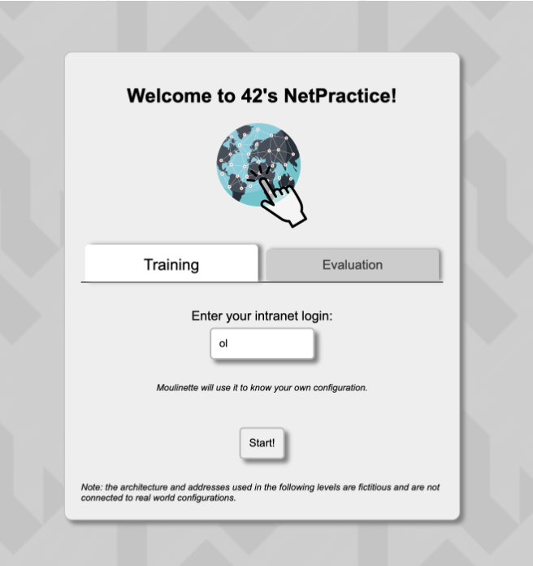
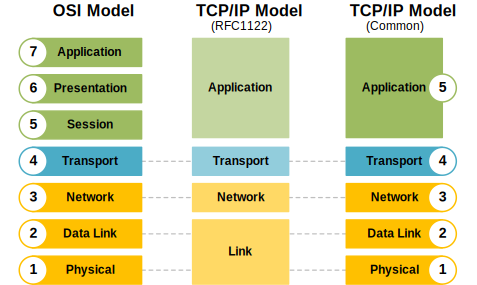

_This project has been created as partof the 42 curriculum by syee_
# NetPractice

## Description 
Netpractice is an activity desgned to intorduce the basics of  **computer networking**. In this activity i will lean how to configure **IP addresses**, **connect devices** though a **router** and understand the role of a **gateway**.

There conists of **10 networking** problems presented in the form of levels.  

## Instructions
Steps to run the activity in the form of a web page :

1. download the .tar file provided in the subject page and extract to a folder 
2. Within the folder "NetPractice" open termonal and run ```./run.sh```
3. The interface will be available on the browser

4. enter the credentials and start 

## Resources
_The following section will addreses the concepts learnt and the sources accessed for the materials_

### TCP/IP addressing
- public IP
- private IP

### Subnet masks
- explaination
- how to calculate subnet masks

### default gateways
-

---
### Routers
- Devices that route packet to 

### Switches
Types of switches include :
	1. L2 (layer 2 switch)
	2. L3 (Layer 3 switch)
	

#### Differences of switches and Routers

--- 
### OSI layers : Open systems interconneciton 
#### Layers (7) low to highest:
Acrostic to memorize : A Priest Saw Two Nuns Doing Push-ups
1. Physical
2. Datalink
3. Network
4. Transport
5. Session 
6. Presentation
7. Application

source : https://www.fortinet.com/resources/cyberglossary/osi-model

### TCP/IP : Trasnmission Control Protocol/Internet Protocol 
#### Layers (5)
1. Application Layer
2. Transport Layer
3. Internet Layer
4. Data Link Layer
5. Physical Layer



source : https://www.networkacademy.io/ccna/network-fundamentals/understanding-the-osi-model

### Comparing TCP/IP and OSI layer

These two concepts are the 
--- 


