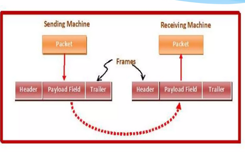

_This project has been created as partof the 42 curriculum by syee_
# NetPractice

## Description 
Netpractice is an activity desgned to intorduce the basics of  **computer networking**. In this activity i will learn how to configure **IP addresses**, **connect devices** though a **router** and understand the role of a **gateway**.

There conists of **10 networking** problems presented in the form of levels.  

## Instructions
Steps to run the activity in the form of a web page :

1. Download the .tar file provided in the subject page and extract to a folder 
2. Within the folder "NetPractice" open termonal and run ```./run.sh```
3. The interface will be available on the browser

	
4. Enter the credentials and start 

## Resources
_The following section will addreses the concepts learnt and the sources accessed for the materials_

### TCP/IP addressing
---
- TCP/IP includes an **Internet addressing scheme** that allows users and applications to **identify a specific network or host with which to communicate**

- Internet addresses are made up of a **network address** and a **host (or local) address**.
	- This two-part address allows a sender to **specify the network** & a specific **host** on the network. _(In layman terms, network is the taman you live in , host is your house)_
	- Example:
		- IP Address: `192.168.1.25`
		- Network Address: `192.168.1.0/24`
		- Host Address: `25`

- The Internet addressing scheme consists of **Internet Protocol (IP) addresses** and two special cases of IP addresses: **broadcast addresses** and **loopback addresses.**
	- **Internet addresses** : 
		- The Internet Protocol (IP) uses a 32-bit, two-part address field.
		- Example:
			- `8.8.8.8` (Google Public DNS)
			- `192.168.1.10` (private network host)
	- **Subnet addresses** : 
		- Subnet addressing allows an autonomous system made up of multiple networks to share the same Internet address.
		- Example:
			- Organization network: `192.168.0.0/16`
			- Subnet A: `192.168.1.0/24`
			- Subnet B: `192.168.2.0/24`
		- Subnet address vs subnet mask : 
		- Subnet vs VLAN : 

			_source : https://www.geeksforgeeks.org/computer-networks/difference-between-vlan-and-subnet/_
	- **Broadcast addresses** : 
		- The TCP/IP can send data to all hosts on a local network or to all hosts on all directly connected networks. Such transmissions are called broadcast messages.
		 Example:
			- Network: `192.168.1.0/24`
			- Broadcast Address: `192.168.1.255`
			- A packet sent to `192.168.1.255` is received by all hosts on the `192.168.1.0/24` network.
	- **Local loopback addresses** : 
		- The Internet Protocol defines the special network address, `127.0.0.1`, as a local loopback address.
		Example:
			- `127.0.0.1` (localhost)
			- A web server running on your machine can be accessed at `http://127.0.0.1`.

	_source for TCP/IP addressing : https://www.ibm.com/docs/en/aix/7.2.0?topic=protocol-tcpip-addressing_


**IPv4 and IPv6 are versions of the Internet Protocol (IP), which is part of the TCP/IP suite. They define how devices are addressed and identified on a network.**

#### IPv4
---
- An IPV4 address is **32 bits** binary long, divided into **four 8-bit segments** (bytes, 8 bit = 1 byte).
- Each segment/octet ranges from **0 to 255** inclusive. Because 8-bit binary number ranges from **00000000₂ (0)** to **11111111₂ (255)**.
- **CIDR** notation, suffix (e.g., ``/24``) indicates how many of those 32 bits are used for the **network** portion 

- |CIDR |	Subnet Mask 	|	Usable IPs 	|	Comment |
	|-----|-------------	|--------------	|------------|
	|/8  |	255.0.0.0 		|	16,777,214 	|	Very large (Class A) network|
	|/16 |	255.255.0.0 	|	65,534		|Large (Class B) network|
	|/24 |	255.255.255.0 	|	254			|Common for small networks|
	|/30 |	255.255.255.252 |	2			|	Used for point-to-point links|
	|/32 |	255.255.255.255	|1				|Represents a single IP address|

	_source for CIDR : https://en.wikipedia.org/wiki/Classless_Inter-Domain_Routing_


##### Subnet masks
---
> Subnet mask → determines block size → determines subnet ranges

- What are subnet masks :
	-  Subnet mask helps a device determine whether another device is on the same local network or on a different network, which in turn decides whether communication is direct or must go through a router.

- Example of relationship for subnet mask

	| Subnet Mask           | Block Size | Number of Subnets (/24) | Subnet Ranges                  |
	| --------------------- | ---------- | ----------------------- | ------------------------------ |
	| /24 (255.255.255.0)   | 256        | 1                       | 0–255                          |
	| /25 (255.255.255.128) | 128        | 2                       | 0–127, 128–255                 |
	| /26 (255.255.255.192) | 64         | 4                       | 0–63, 64–127, 128–191, 192–255 |


#### IPv6
---


#### Sample questions to solidify understanding for IPs and Subnets:
---
1. Provided a subnet of `192.168.10.25/25`, what are the IPs within this network?
	1.  Finding the **subnet mask**
		```
		/25 prefix:

		11111111.11111111.11111111.10000000
		(the first 25 bits are network bits)

		Bit values:
		x         . x         . x         . 2^7  2^6  2^5  2^4  2^3  2^2  2^1  2^0
		11111111  . 11111111  . 11111111  . 1    0    0    0    0    0    0    0

		Last octet:

		Bit position:  2^7  2^6  2^5  2^4  2^3  2^2  2^1  2^0
		Bits:          1    0    0    0    0    0    0    0
		Values:       128   64   32   16    8    4    2    1

		128 + 0 + 0 + 0 + 0 + 0 + 0 + 0 = 128

		Decimal:
		255       . 255       . 255       . 128

		> Subnet Mask: 255.255.255.128
		```
	2.  Amount of usable hosts per subnet
		```
		> Using the formula [2 ^ (32 - N)] - 2 (for loopback and broadcast) :

		[2 ^ (32 - 25)] - 2
		= [2 ^ 7] -2
		= 126 

		> There are 126 usable addreseeses/hosts
		```
	3.  Range of network
		- Step 1 : Find block size
			```
			Block size 	= 256 - 128
						= 128
			```
		- Step 2 : find the amount of subnets
			- To calculate the total number of subnets you can create in a network, use the formula (2^s), where s is the number of bits borrowed from the host portion of the IP address.Each borrowed bit doubles the number of possible subnets.
			```
			Borrowed bits = 25 - 24 = 1

			Number of subnets = 2^1 = 2
			```
		- Step 3 : List subnet ranges
			```
			192.168.10.0   - 192.168.10.127
			192.168.10.128 - 192.168.10.255
			```

	4. Usable host range for the given IP
		```
		> In this scenario given that the IP is 192.168.10.25/25

		First Host: 192.168.10.1
		Last Host:  192.168.10.126
		Network address : 192.168.10.0 /25
		Host address 	: 192.168.10.25 /25
		Broadcast address ; 192.168.10.127
		```
	> Guide :
	>1. Determine the Subnet Mask
	>2. Calculate Usable Hosts
	>3. Determine the Network Range
	>   	- Find block size
	>   	- List subnet ranges
	>   	- Calculate number of subnets
	>4. Determine the Usable Host Range
	>


2. Given a subnet of `/21` , which of the IP is not in the same range as others
	
	a. 172.16.16.16
	
	b. 172.16.15.15
	
	c. 172.16.10.10
	
	d. 172.16.8.8

	1.  Finding the **subnet mask**
		```
		/21 prefix:

		11111111.11111111.11111000.00000000
		(the first 21 bits are network bits)

		Bit values:
		x         . x         . 2^7  2^6  2^5  2^4  2^3  2^2  2^1  2^0 . x         
		11111111  . 11111111  . 1    1    1    1    1    0    0    0   . 00000000

		Last octet:

		Bit position:  2^7  2^6  2^5  2^4  2^3  2^2  2^1  2^0
		Bits:          1    1    1    1    1    0    0    0
		Values:       128   64   32   16    8    4    2    1

		128 + 64 + 32 + 16 + 8 + 0 + 0 + 0 = 248

		Decimal:
		255       . 255       . 248       . 0

		> Subnet Mask: 255.255.248.0
		```
	2.  Amount of usable hosts per subnet
		```
		> Using the formula [2 ^ (32 - N)] - 2 (for loopback and broadcast) :

		[2 ^ (32 - 21)] - 2
		= [2 ^ 11] -2
		= 2046 

		> There are 126 usable addreseeses/hosts
		```
	3.  Range of network
		- Step 1 : Find block size
			```
			Block size 	= 256 - 248
						= 8
			```
		- Step 2 : find the amount of subnets
			```
			Borrowed bits = 21 - 16 = 5

			Number of subnets = 2^5 = 32
			```
		- Step 3 : List subnet ranges
			```
			> Given that the block size is 8, increment the 3rd octet into blocks of 8
			172.16.0.0   - 172.16.7.255
			172.16.8.0   - 172.16.15.255
			172.16.16.0  - 172.16.23.255
			172.16.24.0  - 172.16.31.255
			172.16.32.0  - 172.16.39.255
			```

	4. IP that is not the same range with others
		```
		ans : a.  172.16.16.16

		b. 172.16.15.15
		c. 172.16.10.10
		d. 172.16.8.8

		are all within the subnet : 172.16.8.0   - 172.16.15.255
		```
3. Given 255.255.255.252 /30 , what are the range of usable IP
	1. Find the subnet mask
		```
		Subnet mask is given as /30
		```
	2. Find the amount of usabale host
		```
		> Using the formula [2 ^ (32 - N)] - 2 (for loopback and broadcast) :

		[2 ^ (32 - 30)] - 2
		= [2 ^ 4] -2
		= 2
		```
	3. Range of network
		- Step 1 : Find block size
			```
			Block size 	= 256 - 252
						= 4
			```
		- Step 2 : find the amount of subnets
			```
			Borrowed bits = 30 - 24 = 6

			Number of subnets = 2^6 = 64
			```
		- Step 3 : List subnet ranges
			```
			> Given that the block size is 4, increment the 4th octet into blocks of 4
			192.168.255.0 - 192.168.255.3
			192.168.255.4 - 192.168.255.7
			192.168.255.8 - 192.168.255.11
			...
			```
	4. range of usable IP

---

#### Public IP ranges :
| Class   | Range                                                       | CIDR (Equivalent)                      | Common Use Example                            |
| ------- | ----------------------------------------------------------- | -------------------------------------- | --------------------------------------------- |
| Class A | 1.0.0.0 – 9.255.255.255 & 11.0.0.0 – 126.255.255.255        | /8 (1.0.0.0/8 overall class space)     | Large public networks (ISPs, global services) |
| Class B | 128.0.0.0 – 172.15.255.255 & 172.32.0.0 – 191.255.255.255   | /16 (128.0.0.0/16 overall class space) | Medium-sized organizations                    |
| Class C | 192.0.0.0 – 192.167.255.255 & 192.169.0.0 – 223.255.255.255 | /24 (192.0.0.0/24 overall class space) | Small networks, general public addressing     |

#### Private IP range :
| Class   | Range                         | CIDR           | Common Use Example           |
| ------- | ----------------------------- | -------------- | ---------------------------- |
| Class A | 10.0.0.0 – 10.255.255.255     | 10.0.0.0/8     | Large enterprise networks    |
| Class B | 172.16.0.0 – 172.31.255.255   | 172.16.0.0/12  | Corporate / managed networks |
| Class C | 192.168.0.0 – 192.168.255.255 | 192.168.0.0/16 | Home / office routers        |

#### Special IP range :
| Address / Block                               | Name                         | Purpose / Notes                                                                                                                                         |
| --------------------------------------------- | ---------------------------- | ------------------------------------------------------------------------------------------------------------------------------------------------------- |
| 0.0.0.0                                       | Unspecified address          | “This host (unknown address)”; used as a source before a host gets an IP. Not assigned to interfaces. (Default route 0.0.0.0/0 is a different concept.) |
| 255.255.255.255                               | Limited broadcast            | Broadcast to the local (layer-2) network only; routers must not forward.                                                                                |
| **127.0.0.0/8**                               | **Loopback**                 | Host-internal traffic (e.g., 127.0.0.1); never leaves the device. Used to test local TCP/IP stack via ping.                                             |
| 169.254.0.0/16                                | Link-local (APIPA)           | Automatically self-assigned when DHCP is unavailable (common in Windows via Automatic Private IP Addressing).                                           |
| 224.0.0.0/4                                   | Multicast                    | Group addressing. 224.0.0.0/24 local-subnet control; 239.0.0.0/8 admin-scoped. Not unicast.                                                             |
| 240.0.0.0/4                                   | Reserved                     | Reserved for future use; commonly treated as invalid by hosts/routers.                                                                                  |
| 100.64.0.0/10                                 | CGNAT (Shared address space) | Used by ISPs for carrier-grade NAT; distinct from private RFC1918 ranges.                                                                               |
| 192.0.2.0/24, 198.51.100.0/24, 203.0.113.0/24 | TEST-NET 1/2/3               | Documentation and examples only; safe for labs and manuals. Not used on the public Internet.                                                            |
| 198.18.0.0/15                                 | Benchmarking                 | Network interconnect testing and performance benchmarking (non-Internet use).                                                                           |

_source for ip address ranges : https://www.meridianoutpost.com/resources/articles/IP-classes.php_

_source for public and private addreses : https://www.geeksforgeeks.org/computer-networks/difference-between-private-and-public-ip-addresses/_

#### Additional infomartion 
1. In order to allow internal IP addresses to connect to external network. Routers carry out NAT (network addresss translation). There are several types of NAT :
	-  Static : 1 private is mapped to 1 public address
	- PAT Pool : Multiple private addresses can be connected to a pool of public addresses
	- PAT Overloading : Many private ip addresses uses 1 public IP


### Default gateways
---
- 


### Routers
---
- Devices that route packet to 

### Switches
---
What is a network switch ?

Types of switches include :
1. L2 (layer 2 switch)
2. L3 (Layer 3 switch)

_source : https://www.cloudflare.com/learning/network-layer/what-is-a-network-switch/_

#### Differences of switches and Routers

--- 
### OSI layers : Open systems interconneciton 
Purpose of the layers are to transmit raw bits from physical hardware to an interface over the internet.

#### Layers (7) low to highest:
Acrostic to memorize : A Priest Saw Two Nuns Doing Push-ups
1. **Physical** : sends out raw bits

2. **Datalink** : takes raw bits and organizes it into **frames**. (frame : a unit of data transmission (data packet) in OSI model consisting of header, payload and trailer)
	- Handles : 
		- Framing (organizing raw bits into frames)
		- MAC addressing (source/destination) (in header)
		- Error detection/correction (in trailer)
		- Encoding/decoding
	- Contents of a frame :
		- header : usually just MAC address (src and dest)
		- payload : actual data, can be anything
		- trailer : extra infromation added at the end of the frame 
	
		
	- Examples of frame : 
		```
		ethernet frame
		[Dest MAC | Source MAC] | Payload | trailer
		```
		```
		WIFI frame 
		[Dest MAC | Source MAC | BSSID | Seq No.] | Payload | trailer
		```

	> all frames have the same format (3 items), there are different types of frames (ethernet , wifi). All frames will get sent out eventualy, subsequently one by one. 

	_source for frame content : https://www.slideshare.net/slideshow/framing-in-data-link-layer-136604265/136604265#2_
	
	_source : https://www.geeksforgeeks.org/computer-networks/data-link-layer/_

3. Network : 
4. Transport
5. Session 
6. Presentation
7. Application


_source : https://www.fortinet.com/resources/cyberglossary/osi-model_

### TCP/IP : Trasnmission Control Protocol/Internet Protocol 
#### Layers (5)
1. Application Layer
2. Transport Layer
3. Internet Layer
4. Data Link Layer
5. Physical Layer


_source : https://www.networkacademy.io/ccna/network-fundamentals/understanding-the-osi-model_

### Comparing TCP/IP and OSI layer

These two concepts are the 
--- 


$\Sigma$