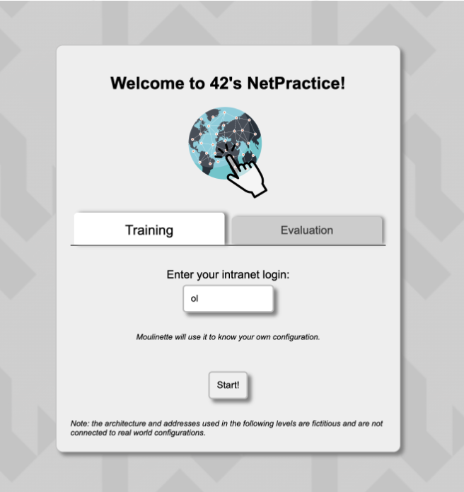
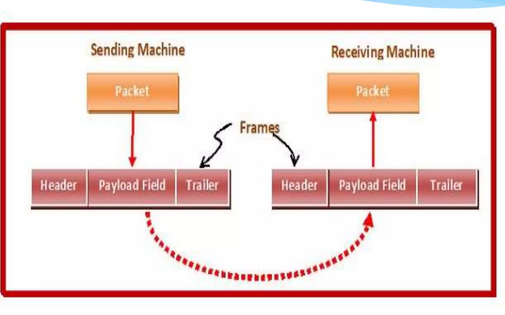

_This project has been created as part of the 42 curriculum by syee._
# NetPractice

## Description 
Netpractice is an activity desgned to intorduce the basics of  **computer networking**. In this activity i will learn how to configure **IP addresses**, **connect devices** though a **router** and understand the role of a **gateway**.

There conists of **10 networking** problems presented in the form of levels.  

## Instructions
Steps to run the activity in the form of a web page :

1. Download the .tar file provided in the subject page and extract to a folder 
2. Within the folder "NetPractice" open termonal and run ```./run.sh```
3. The interface will be available on the browser

	
4. Enter the credentials and start 

## Resources
_The following section will addreses the concepts learnt and the sources accessed for the materials_

### 1.0 Computers identifying each other
---
#### IP address
---
<details>
<summary> IP address analogy </summary>

	Imagine Obama wants to send data to Joe Biden, But Obama has a problem. _"How do i know which computer (house) is Biden's ?"_. 

 	Each computer needs a unique adddress, so that the data knows where to go. This is where **IP addressses** come in.
</details>

- Internet addresses are made up of 2 informations : a **network address** and a **host (or local) address**.
	- This two-part address allows a sender to **specify the network** & a specific **host** on the network. 
	- _(In layman terms, network is the taman you live in , host is your house)_
	- Example:
		- IP Address (House address) : `192.168.1.25`
		- Network Address (Taman lived in): `192.168.1.0/24`
		- Host Address (House number plate): `25`

Network address are written in the form of IPV4 and IPV6 

##### IPv4
---
- An IPV4 address is **32 bits** binary long, divided into **four 8-bit segments** (bytes, 8 bit = 1 byte).
- Each segment/octet ranges from **0 to 255** inclusive. Because 8-bit binary number ranges from **00000000₂ (0)** to **11111111₂ (255)**.
- **CIDR** notation, suffix (e.g., ``/24``) indicates how many of those 32 bits are used for the **network** portion 

- |CIDR |	Subnet Mask 	|	Usable IPs 	|	Comment |
	|-----|-------------	|--------------	|------------|
	|/8  |	255.0.0.0 		|	16,777,214 	|	Very large (Class A) network|
	|/16 |	255.255.0.0 	|	65,534		|Large (Class B) network|
	|/24 |	255.255.255.0 	|	254			|Common for small networks|
	|/30 |	255.255.255.252 |	2			|	Used for point-to-point links|
	|/32 |	255.255.255.255	|1				|Represents a single IP address|

	_source for CIDR : https://en.wikipedia.org/wiki/Classless_Inter-Domain_Routing_

##### IPv6
---

- An **IPv6 address is 128 bits** long.
- It is written as **eight groups of 16-bit hexadecimal values**, separated by colons (`:`).
- Example:

	`2001:0db8:85a3:0000:0000:8a2e:0370:7334`

- Each group contains **4 hexadecimal digits**, ranging from `0000` to `ffff`.
- IPv6 provides a vastly larger address space than IPv4 because it uses **128 bits** instead of 32 bits.
- IPv6 addresses can be shortened:
	- Leading zeros can be removed:
		- `0db8` → `db8`
		- `0370` → `370`
	- One consecutive sequence of zero groups can be replaced with `::`:
		- `2001:db8:0:0:0:0:1:1`
		- → `2001:db8::1:1`
	- `::` can only be used **once** in an address.
- IPv6 also uses prefix notation, similar to IPv4:
	- Example: `2001:db8:abcd:1234::/64`
	- `/64` means the first **64 bits** identify the network/prefix.
	- The remaining **64 bits** identify the interface within that network.

| Prefix | Typical Use | Meaning |
|--------|-------------|---------|
| `/128` | Single address | Identifies one specific IPv6 address |
| `/64` | Normal network | Common IPv6 network size |
| `/48` | Organization/site | Common allocation for a larger network |
| `/32` | Internet provider | Large allocation for an ISP |


#### MAC address
---

- A **MAC (Media Access Control) address** is a link-layer address used to identify a **network interface on a local network**.
- A typical MAC address is **48 bits (6 bytes)** long.
- It is usually written as six hexadecimal pairs.
- Example:
	- `00:1A:2B:3C:4D:5E`
- When a device sends an Ethernet frame to another device on the same network, the frame contains:
	- **Source MAC** → the sender's network interface
	- **Destination MAC** → the receiving network interface
- MAC addresses belong to **network interfaces**, not necessarily the entire computer.
	- A computer with Ethernet and Wi-Fi can have **two different MAC addresses**.
- A MAC address is primarily used for **local network communication**.
- A MAC address does **not normally tell the internet where a device is located**. Routers use IP addresses to communicate between networks.

> **Layman analogy:**
> - **IP address** = where the house is located
> - **MAC address** = which specific network interface should receive the delivery locally

#### Interface
---

- A **network interface** is the point where a device **connects to a network**.
- It can be:
	- **Physical** → Ethernet network card, Wi-Fi adapter
	- **Virtual** → VPN, virtual machine, container, etc.
- A network interface can have:
	- **MAC address** → identifies the interface on the local network
	- **IP address** → identifies the interface at the network layer
- A single computer can have **multiple network interfaces**.

Example:

	Computer
	│
	├── Ethernet
	│   ├── MAC: AA:BB:CC:DD:EE:FF
	│   └── IP: 192.168.1.25
	│
	└── Wi-Fi
	    ├── MAC: 11:22:33:44:55:66
	    └── IP: 192.168.1.26

> **Layman analogy:**
> - **Computer** = your house
> - **Network interface** = the door connecting your house to the road
> - **MAC address** = identifier for that door
> - **IP address** = network address assigned to that connection


### Subnet masks
---
<details>
<summary> Subnet mask analogy </summary>

	After Obama knows which is Biden's computer, he wants has another problem : _"Is Biden in the same subnet(taman) as me, or somewhere else?"_

	If Biden is in the same subnet (taman), Obama can send the packet directly. 

	If Biden is in a different subnet (taman), Obama must ask a router to deliver it.

	But how can Obama determine which part of an IP address represents the subnet (taman) and which part represents the host (house)?

	This is where **subnet masks** comes in.

</details>

- What are subnet masks :
	-  Subnet mask helps a device determine whether another device is on the same local network or on a different network, which in turn decides whether communication is direct or must go through a router.
	- Subnet masks tells a device which portion of the IP address represents the **network** , an which portion represents the **host**
	- Example :
		- Obama : `192.168.1.10/24`
		- Biden : `192.168.1.25/24`
		- Subnet Mask : `255.255.255.0`
		- With the subnet mask bith devices know thier netowrk address is `192.168.1.0`
		```
		Obama : 
		192 . 168 . 1   . 10
		255 . 255 . 255 . 0
		
		Biden : 
		192 . 168 . 1   . 25
		255 . 255 . 255 . 0
		
		Netowrk address : 
		192 . 168 . 1   . 0
		```
- With subnet masks, we can determine how many devices can be on a subnet and the range of the subnet. Example of relationship for subnet mask :

	| Subnet Mask           | Block Size | Number of Subnets (/24) | Subnet Ranges                  |
	| --------------------- | ---------- | ----------------------- | ------------------------------ |
	| /24 (255.255.255.0)   | 256        | 1                       | 0–255                          |
	| /25 (255.255.255.128) | 128        | 2                       | 0–127, 128–255                 |
	| /26 (255.255.255.192) | 64         | 4                       | 0–63, 64–127, 128–191, 192–255 |

source for underatnding how devices communicate with each other: https://www.youtube.com/watch?v=pCcJFdYNamc
### Subnet addresses
---
<details>
<summary> Subnet address analogy </summary>

	Imagine Obama lives in a large district (Daerah), If every house is just placed in the district with no breakdown, it would be difficult for postmen to organize deliveries. 

	To make the navigation easier, Jeffery cheah divides the district into small Tamans. This process is called **subnetting**
	Once the neighborhoods are created, each neighborhood needs an identifier.

	This is where **subnet address** comes in.

</details>

- Subnet addressing allows an autonomous system made up of multiple networks to share the same Internet address.
- Example:
	- (Netowrk) District: `192.168.0.0/16`
	- (Subnet A) Taman A: `192.168.1.0/24`
	- (Subnet B) Taman B: `192.168.2.0/24`

- Every subnet reserves two addresses that cannot normally be assigned to hosts:
	1. **First address (Network/Subnet Address)**
		- Identifies the subnet itself.
		- Used by routers and hosts to refer to the network as a whole.

	2. **Last address (Broadcast Address)**
		- Used to send data to all hosts within the subnet.
		- Cannot be assigned to an individual device.


- Differentiating **Subnet address** vs **subnet mask** : 
	- **Subnet address a.k.a Network address** is the first address within a subnet that defines the subnet as a whole and the routers use this to send data 
	- Example : 
		- Range : `192.168.255.0 - 192.168.255.3`
		- Subnet address : `192.168.255.0`
	- **Subnet mask** determines which part of the ip address is the _host_ and _network_ portion
	- Example :
		- `255.255.255.0`
		- in CIDR notation : `\24`


### 2.0 Types of IP addresses
---
#### Public IP ranges :
| Class   | Range                                                       | CIDR (Equivalent)                      | Common Use Example                            |
| ------- | ----------------------------------------------------------- | -------------------------------------- | --------------------------------------------- |
| Class A | 1.0.0.0 – 9.255.255.255 & 11.0.0.0 – 126.255.255.255        | /8 (1.0.0.0/8 overall class space)     | Large public networks (ISPs, global services) |
| Class B | 128.0.0.0 – 172.15.255.255 & 172.32.0.0 – 191.255.255.255   | /16 (128.0.0.0/16 overall class space) | Medium-sized organizations                    |
| Class C | 192.0.0.0 – 192.167.255.255 & 192.169.0.0 – 223.255.255.255 | /24 (192.0.0.0/24 overall class space) | Small networks, general public addressing     |

#### Private IP range :
| Class   | Range                         | CIDR           | Common Use Example           |
| ------- | ----------------------------- | -------------- | ---------------------------- |
| Class A | 10.0.0.0 – 10.255.255.255     | 10.0.0.0/8     | Large enterprise networks    |
| Class B | 172.16.0.0 – 172.31.255.255   | 172.16.0.0/12  | Corporate / managed networks |
| Class C | 192.168.0.0 – 192.168.255.255 | 192.168.0.0/16 | Home / office routers        |

#### Special IP range :
| Address / Block                               | Name                         | Purpose / Notes                                                                                                                                         |
| --------------------------------------------- | ---------------------------- | ------------------------------------------------------------------------------------------------------------------------------------------------------- |
| 0.0.0.0                                       | Unspecified address          | “This host (unknown address)”; used as a source before a host gets an IP. Not assigned to interfaces. (Default route 0.0.0.0/0 is a different concept.) |
| 255.255.255.255                               | Limited broadcast            | Broadcast to the local (layer-2) network only; routers must not forward.                                                                                |
| **127.0.0.0/8**                               | **Loopback**                 | Host-internal traffic (e.g., 127.0.0.1); never leaves the device. Used to test local TCP/IP stack via ping.                                             |
| 169.254.0.0/16                                | Link-local (APIPA)           | Automatically self-assigned when DHCP is unavailable (common in Windows via Automatic Private IP Addressing).                                           |
| 224.0.0.0/4                                   | Multicast                    | Group addressing. 224.0.0.0/24 local-subnet control; 239.0.0.0/8 admin-scoped. Not unicast.                                                             |
| 240.0.0.0/4                                   | Reserved                     | Reserved for future use; commonly treated as invalid by hosts/routers.                                                                                  |
| 100.64.0.0/10                                 | CGNAT (Shared address space) | Used by ISPs for carrier-grade NAT; distinct from private RFC1918 ranges.                                                                               |
| 192.0.2.0/24, 198.51.100.0/24, 203.0.113.0/24 | TEST-NET 1/2/3               | Documentation and examples only; safe for labs and manuals. Not used on the public Internet.                                                            |
| 198.18.0.0/15                                 | Benchmarking                 | Network interconnect testing and performance benchmarking (non-Internet use).                                                                           |

_source for ip address ranges : https://www.meridianoutpost.com/resources/articles/IP-classes.php_

_source for public and private addreses : https://www.geeksforgeeks.org/computer-networks/difference-between-private-and-public-ip-addresses/_

#### Broadcast address & Loopback address
---
- The Internet addressing scheme consists of **Internet Protocol (IP) addresses** and several special cases of IP addresses but more notably : **broadcast addresses** and **loopback addresses.**
	- **Internet addresses** : 
		- The Internet Protocol (IP) uses a 32-bit, two-part address field.
		- Example:
			- `8.8.8.8` (Google Public DNS)
			- `192.168.1.10` (private network host)

	- **Broadcast addresses** : 
		- The TCP/IP can send data to all hosts on a local network or to all hosts on all directly connected networks. Such transmissions are called broadcast messages.
		 Example:
			- Network: `192.168.1.0/24`
			- Broadcast Address: `192.168.1.255`
			- A packet sent to `192.168.1.255` is received by all hosts on the `192.168.1.0/24` network.
		- _How do you define a broadcast address ?_
			- f

	- **Local loopback addresses** : 
		- The Internet Protocol defines the special network address, `127.0.0.1`, as a local loopback address.
		Example:
			- `127.0.0.1` (localhost)
			- A web server running on your machine can be accessed at `http://127.0.0.1`.
		- _Why do we need a loopback address_ ?
			_source : https://www.reddit.com/r/networking/comments/1bgc63t/what_is_the_point_of_a_loopback_address/_

			Consider this scenario : 
			
			``
			dede
			``


### 3.0 Fromula to find IPs and Subnets:
---
#### 1. Provided a subnet of `192.168.10.25/25`, what are the IPs within this network?
1.  Finding the **subnet mask**
	```
	/25 prefix:

	11111111.11111111.11111111.10000000
	(the first 25 bits are network bits)

	Bit values:
	x         . x         . x         . 2^7  2^6  2^5  2^4  2^3  2^2  2^1  2^0
	11111111  . 11111111  . 11111111  . 1    0    0    0    0    0    0    0

	Last octet:

	Bit position:  2^7  2^6  2^5  2^4  2^3  2^2  2^1  2^0
	Bits:          1    0    0    0    0    0    0    0
	Values:       128   64   32   16    8    4    2    1

	128 + 0 + 0 + 0 + 0 + 0 + 0 + 0 = 128

	Decimal:
	255       . 255       . 255       . 128

	> Subnet Mask: 255.255.255.128
	```
2.  Amount of usable hosts per subnet
	```
	> Using the formula [2 ^ (32 - N)] - 2 (for network address and broadcast) :

	[2 ^ (32 - 25)] - 2
	= [2 ^ 7] -2
	= 126 

	> There are 126 usable addreseeses/hosts
	```
3.  Range of network
	- Step 1 : Find block size
		```
		Block size 	= 256 - 128
					= 128
		```
	- Step 2 : find the amount of subnets
		- To calculate the total number of subnets you can create in a network, use the formula (2^s), where s is the number of bits borrowed from the host portion of the IP address.Each borrowed bit doubles the number of possible subnets.
		```
		Borrowed bits = 25 - 24 = 1

		Number of subnets = 2^1 = 2
		```
	- Step 3 : List subnet ranges
		```
		192.168.10.0   - 192.168.10.127
		192.168.10.128 - 192.168.10.255
		```

4. Usable host range for the given IP
	```
	> In this scenario given that the IP is 192.168.10.25/25

	First Host: 192.168.10.1
	Last Host:  192.168.10.126
	Network address : 192.168.10.0 /25
	Host address 	: 192.168.10.25 /25
	Broadcast address ; 192.168.10.127
	```
> Guide :
>1. Determine the Subnet Mask
>2. Calculate Usable Hosts
>3. Determine the Network Range
>   	- Find block size
>   	- List subnet ranges
>   	- Calculate number of subnets
>4. Determine the Usable Host Range
>


#### 2. Given a subnet of `/21` , which of the IP is not in the same range as others
	
a. 172.16.16.16

b. 172.16.15.15

c. 172.16.10.10

d. 172.16.8.8

1.  Finding the **subnet mask**
	```
	/21 prefix:

	11111111.11111111.11111000.00000000
	(the first 21 bits are network bits)

	Bit values:
	x         . x         . 2^7  2^6  2^5  2^4  2^3  2^2  2^1  2^0 . x         
	11111111  . 11111111  . 1    1    1    1    1    0    0    0   . 00000000

	
	Bit position:  2^7  2^6  2^5  2^4  2^3  2^2  2^1  2^0
	Bits:          1    1    1    1    1    0    0    0
	Values:       128   64   32   16    8    4    2    1

	128 + 64 + 32 + 16 + 8 + 0 + 0 + 0 = 248

	Decimal:
	255       . 255       . 248       . 0

	> Subnet Mask: 255.255.248.0
	```
2.  Amount of usable hosts per subnet
	```
	> Using the formula [2 ^ (32 - N)] - 2 (for network address and broadcast) :

	[2 ^ (32 - 21)] - 2
	= [2 ^ 11] -2
	= 2046 

	> There are 2046 usable addreseeses/hosts
	```
3.  Range of network
	- Step 1 : Find block size
		```
		Block size 	= 256 - 248
					= 8
		```
	- Step 2 : find the amount of subnets
		```
		Borrowed bits = 21 - 16 = 5

		Number of subnets = 2^5 = 32
		```
	- Step 3 : List subnet ranges
		```
		> Given that the block size is 8, increment the 3rd octet into blocks of 8
		172.16.0.0   - 172.16.7.255
		172.16.8.0   - 172.16.15.255
		172.16.16.0  - 172.16.23.255
		172.16.24.0  - 172.16.31.255
		172.16.32.0  - 172.16.39.255
		```

4. IP that is not the same range with others
	```
	ans : a.  172.16.16.16

	b. 172.16.15.15
	c. 172.16.10.10
	d. 172.16.8.8

	are all within the subnet : 172.16.8.0   - 172.16.15.255
	```
#### 3. Given 255.255.255.252 /30 , what are the range of usable IP
1. Find the subnet mask
	```
	Subnet mask is given as /30
	```
2. Find the amount of usabale host
	```
	> Using the formula [2 ^ (32 - N)] - 2 (for network(subnet) address and broadcast) :

	[2 ^ (32 - 30)] - 2
	= [2 ^ 4] -2
	= 2
	```
3. Range of network
	- Step 1 : Find block size
		```
		Block size 	= 256 - 252
					= 4
		```
	- Step 2 : find the amount of subnets
		```
		Borrowed bits = 30 - 24 = 6

		Number of subnets = 2^6 = 64
		```
	- Step 3 : List subnet ranges
		```
		> Given that the block size is 4, increment the 4th octet into blocks of 4
		192.168.255.0 - 192.168.255.3
		192.168.255.4 - 192.168.255.7
		192.168.255.8 - 192.168.255.11
		...
		```

---

### 4.0 Network models 
- source 1 : https://www.youtube.com/watch?v=CRdL1PcherM (Basic difference in TCP/IP and OSI)
- source 2 : https://www.youtube.com/watch?v=3b_TAYtzuho (More detailed differnce between TCP/IP and OSI model, includes explanation on PDUs involved in each layer)
- source 3 : https://www.youtube.com/watch?v=0Rb8AkTEASw (Protocols and futher details on each layer)
- source 4 : https://www.fortinet.com/resources/cyberglossary/osi-model

Network models are a framework used to decide how data is transmitted over different devices, each layer has thier own protocols. The two main models used are tcp/ip model and OSI model. The OSI model is mode detailed on the application layer compared to the TCP/IP model (OSI > TCP/IP). The following are the breakdown of TCP/IP and OSI model.

In netpractice the focus is placed on L2 (data link) & L3 (network), the following will focus on L4(transport) to L1(Data Link)
#### Layers (7) highest to lowest : 
---

Acrostic to memorize : A Priest Saw Two Nuns Doing Push-ups

- Application 
	- Presentation 
	- Session 

- **Transport** (L4) : 
	- **PDU name** : Segment
	- **Encapsulation Headers**: Source Port Address and Destination Port Address
	- **Operational purpose** :Identifies which port does the service belong to 
	- **Core standards used** :
		- TCP (Transmission Control Protocol)
		- UDP (User Datagram Protocol)

- **Network** (L3): 
	- **PDU name** : Packet 
	- **Encapsulation Headers**: Source IP Address and Destination IP Address
	- **Operational purpose** : dentifies where the data needs to go across networks.
	- **Core standards used** :
		- IPv4 / IPv6 (Internet Protocol): The standard open routing protocol suite used to define logical address spaces 
		- ICMP (Internet Control Message Protocol): Reference Protocol. Handles diagnostic, error, and signaling messages (e.g., ping and traceroute).
		- Routing Maps (OSPF, BGP, RIP): Reference Protocols. Router-to-router mapping systems that help devices calculate the fastest physical hops across the internet.

- **Datalink** (L2): 
	- **PDU name** : Frame
	- **Encapsulation Headers**: 
		- header : usually just MAC address (src and dest)
		- payload : actual data, can be anything
		- trailer : extra infromation added at the end of the frame 
	
		
		- Examples of frame : 
		```
		ethernet frame
		[Dest MAC | Source MAC] | Payload | trailer
		```
		```
		WIFI frame 
		[Dest MAC | Source MAC | BSSID | Seq No.] | Payload | trailer
		```

		> all frames have the same format (3 items), there are different types of frames (ethernet , wifi). All frames will get sent out eventualy, subsequently one by one. 

		_source for frame content : https://www.slideshare.net/slideshow/framing-in-data-link-layer-136604265/136604265#2_
		
		_source : https://www.geeksforgeeks.org/computer-networks/data-link-layer/_
	- **Operational purpose** : Delivers data between devices on the same local network.
	- **Core standards used** :
		- Core Layer Protocols:ARP (Address Resolution Protocol): The translation engine. It translates the IP address to the MAC address so a device can construct a valid frame.
		- Ethernet: The primary data link protocol used for wired transport.

- **Physical** (L1) : 
	- **PDU name** : Bits
	- **Operational purpose** : takes raw binary from L2 and converts them into physical signals (electrical voltages for copper wires, light pulses for fiber optic cables, or radio wave frequencies for wireless transmissions)
	- **Core standards used** : IEEE 802.11 (Wi-Fi standards like 802.11ac / 802.11ax): Standardizes how bits are modulated into high-frequency wireless radio bands

### 5.0 Communitcating between different networks

### Switches 
---
- Devices that work on L2 of the network, its purpose is to act as a bridge between devices on the same local network 

### Routers
---
- Devices that work on L3 of the network, its purpose is to route data between different networks

#### Devices on the same network not allowed to be router in netpractice
--- 
- In netpractice the routers provided are "dummy routers"
	- Switches in real world allow assigning different ranges of interfaces to a specific network 
	- Additionally, local network ports are conneted internally by a built-in Layer2 switch chip which floods ARP broadcasts to all ports. 
	- In Netpractice, the router lacks a L2 switch chip
	- Routers are designed to not foward broadcast traffic between different interfaces to prevent a boratcast storm 
	- A router is designed to take a packet from a network and foward it to an another network, if it sees that its within the same network it will not route it back to its network because it assumes that it will have already transmitted it to that device within the same network


### Step by step flow of acknowldging between devices
---
Note : the scenario provided is confined to the practices given in netpractice 

#### On the same network (switch)
1. PC1 checks the destination IP of PC2 and uses its subnet mask to determine that PC2 is inside the exact same local network block.
2. PC1 checks its local ARP cache for PC2's MAC address. If it is missing, PC1 generates an ARP request broadcast (FF:FF:FF:FF:FF:FF) asking, "Who has PC2's IP? Send me your MAC."
3. The Layer 2 Switch receives the broadcast on its incoming port. Because it is a switch, it replicates and floods that broadcast out of every single active port on the network.
4. PC2 receives the broadcast frame, recognizes its own IP, and replies with a direct Unicast frame containing its hardware MAC address straight back to PC1.
5. PC1 updates its ARP table, encapsulates its data into a standard Ethernet frame stamped with PC2's Destination MAC, and the switch instantly delivers it directly across the local hardware wire.

#### On the same network (router)
1. PC1 checks the ip of PC2 and sees that its in the same network. It will not send the packet to the router's gateway and instead sends an ARP request(a request to check which MAC addresss owns the IP in question)
2. In Netpractice : interface ports are typically connected internally as they have a built-in L2 switch which floods the ARP request to all the ports, but the router in netpratice lacks it. Therefore ARP request boroadcast from PC1 hits th router port and drops.
3. PC1 never receives the ARP response from PC2, is unable to map the destination ip to the address.
Note : 
- while routing, if the interfaces have overlapping networks, the router will choose the route eith the longest matching prefix (LMP)
- e.g. x.x.x.1/24 if there is an itnerface with /25 vs /24, it will choose /24 over /25


#### On the different network (router)
1. PC1 checks the destination IP of PC2, applies its subnet mask, and realizes that PC2 lives on a completely different network block.
2. PC1 prepares the packet to go to its configured Default Gateway (the Layer 3 router's local interface IP).
3. PC1 looks up the router's MAC address via ARP table (or pulls it from its cache) and encapsulates the packet into an Ethernet frame where the Destination IP is PC2, but the Destination MAC is the Router's interface port.
4. The Router receives the frame, strips away the Layer 2 Ethernet header, and passes the raw packet up to its Layer 3 routing table to look for a matching network range.
5. The Router finds the destination subnet map, modifies the Layer 2 headers (switching the source MAC to its own outbound port and the destination MAC to PC2's interface), and forwards the packet out of the secondary interface into the correct network segment.

### AI declaration
---
AI was used in this project to clean up tables for the read me, and create analogies for concepts. Aside from that, no AI was used during the attempts in completing the project.